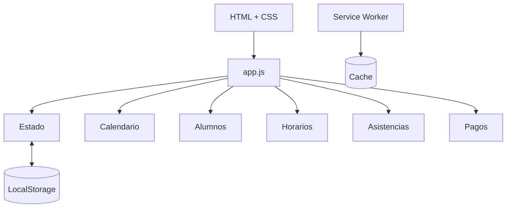

<p align="center">
  
</p>

<p align="center">
  
  
  
  
</p>

## Qué es

Clases App es una aplicación que hice para tener en un solo lugar el control de **alumnos, horarios, clases y pagos**.

No necesita una base de datos ni un servidor para guardar la información: los datos quedan en el navegador usando LocalStorage. Además se puede instalar como PWA y usa un Service Worker para mantener los archivos principales en caché.

## Qué permite hacer

- crear y editar alumnos;
- definir el valor por hora;
- guardar notas de cada alumno;
- organizar horarios semanales;
- marcar si una clase se dio, no se dio o se reprogramó;
- mover una clase a otra fecha y hora;
- registrar pagos;
- crear paquetes o combos de horas;
- controlar cuántas horas le quedan a cada alumno;
- ver avisos cuando quedan pocas horas;
- consultar agenda y calendario;
- revisar movimientos anteriores;
- exportar los datos.

## Cómo está armada



La mayor parte de la lógica está en `app.js`. Ahí se manejan los datos, los formularios, los cálculos y el renderizado de las distintas vistas.

El estado se guarda con esta estructura:

```text
state
├── students
├── schedules
├── classes
├── payments
└── combos
```

Cada vez que se agrega o modifica algo, el estado vuelve a guardarse en LocalStorage.

## Tecnologías

- HTML
- CSS
- JavaScript
- LocalStorage
- Service Worker
- Web App Manifest
- Node.js para el servidor local

No usa frameworks ni dependencias externas para la lógica principal.

## Archivos principales

```text
clases-app/
├── assets/                # Recursos usados en el README
├── index.html             # Interfaz
├── app.js                 # Lógica de la aplicación
├── styles.css             # Estilos
├── sw.js                  # Service Worker
├── manifest.webmanifest   # Configuración de la PWA
├── icon.svg               # Ícono
├── server.mjs             # Servidor local
├── package.json
└── docs/
    └── ARCHITECTURE.md
```

## Ejecutarla

Con Node.js 18 o superior:

```bash
git clone https://github.com/alejoesp/clases-app.git
cd clases-app
npm start
```

Después se abre en:

```text
http://127.0.0.1:4173
```

No hace falta instalar paquetes porque `server.mjs` usa módulos nativos de Node.js.

## Datos y funcionamiento offline

Los datos se guardan en el navegador. Eso hace que la app sea simple y rápida de usar, pero también significa que no hay sincronización automática entre distintos dispositivos.

El Service Worker guarda los archivos principales para que la aplicación pueda seguir cargando aunque no haya conexión en ese momento.

## Documentación

En [docs/ARCHITECTURE.md](docs/ARCHITECTURE.md) está explicada la estructura interna con más detalle.
