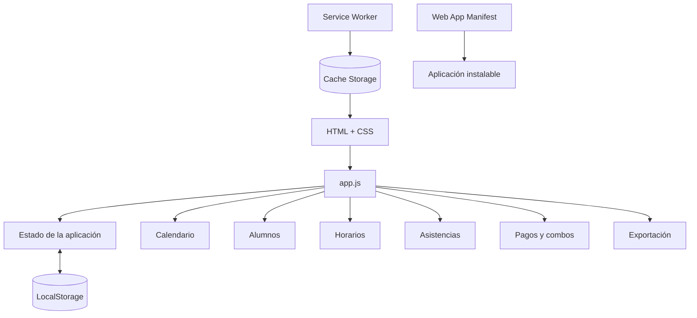

<p align="center">
  
</p>

<p align="center">
  
  
  
  
</p>

<p align="center">
  <strong>Education Tech · Offline First · PWA · Vanilla JavaScript</strong>
</p>

<p align="center">
  <a href="docs/ARCHITECTURE.md">Arquitectura técnica</a>
</p>

## Descripción

**Clases App** es una aplicación web progresiva orientada a la gestión cotidiana de clases particulares. Centraliza información de alumnos, horarios habituales, asistencia, reprogramaciones, paquetes de horas y pagos en una interfaz única.

La aplicación fue diseñada para funcionar de forma liviana y sin depender de una base de datos externa. Los datos se almacenan localmente en el navegador y la aplicación puede instalarse como PWA y utilizar recursos en caché mediante un Service Worker.

## Funcionalidades

- Alta, edición y eliminación de alumnos.
- Valor por hora y notas individuales.
- Horarios semanales recurrentes.
- Registro de clases realizadas.
- Estados de asistencia: **vino**, **no vino** y **reprogramada**.
- Reprogramación con nueva fecha y hora.
- Gestión de pagos.
- Paquetes o combos de horas configurables.
- Cálculo del saldo de horas de cada alumno.
- Avisos cuando quedan pocas horas o existe deuda estimada.
- Resumen del día.
- Total cobrado durante el mes.
- Agenda semanal.
- Calendario mensual.
- Historial de movimientos.
- Exportación de datos.
- Eliminación controlada de registros.
- Funcionamiento como **Progressive Web App**.
- Caché de recursos para uso offline.

## Arquitectura



## Stack tecnológico

### Frontend
- **HTML5** para la estructura.
- **CSS3** para la interfaz responsive.
- **JavaScript Vanilla** para toda la lógica de negocio y renderizado.
- **Web Storage API / LocalStorage** para persistencia.
- **Service Worker API** para caché offline.
- **Web App Manifest** para instalación como PWA.

### Desarrollo local
- **Node.js** mediante un servidor HTTP mínimo incluido en `server.mjs`.
- Sin frameworks.
- Sin dependencias de runtime.

## Modelo de datos

El estado principal se mantiene en el navegador y se organiza en cinco colecciones:

```text
state
├── students   # alumnos y configuración individual
├── schedules  # horarios semanales
├── classes    # asistencia y reprogramaciones
├── payments   # pagos y horas adquiridas
└── combos     # paquetes configurables
```

Cada modificación actualiza el estado y luego lo persiste en `localStorage`.

## Estructura del proyecto

```text
clases-app/
├── assets/                # Recursos de presentación del portfolio
├── index.html             # Estructura principal de la interfaz
├── app.js                 # Estado, lógica y renderizado
├── styles.css             # Diseño responsive
├── sw.js                  # Service Worker y estrategia de caché
├── manifest.webmanifest   # Configuración PWA
├── icon.svg               # Ícono de la aplicación
├── server.mjs             # Servidor HTTP local
├── package.json           # Scripts de desarrollo
├── .gitignore             # Archivos excluidos
└── docs/
    └── ARCHITECTURE.md    # Documentación técnica ampliada
```

## Ejecutar el proyecto

### Opción recomendada

Se requiere **Node.js 18 o superior**.

```bash
git clone https://github.com/alejoesp/clases-app.git
cd clases-app
npm start
```

Luego abrir:

```text
http://127.0.0.1:4173
```

No es necesario instalar dependencias porque el servidor utiliza módulos nativos de Node.js.

## Progressive Web App

La aplicación incluye:

- `manifest.webmanifest` con nombre, ícono y modo standalone;
- `sw.js` para guardar los recursos esenciales;
- interfaz adaptada a dispositivos móviles;
- posibilidad de instalación desde navegadores compatibles.

El Service Worker mantiene en caché los archivos principales de la aplicación y permite reutilizarlos cuando no están disponibles desde la red.

## Persistencia y privacidad

La información se guarda únicamente en el **LocalStorage del navegador** donde se utiliza la aplicación.

Esto implica que:

- no existe sincronización automática entre dispositivos;
- limpiar los datos del navegador puede eliminar la información;
- la aplicación no envía por sí misma alumnos o pagos a un servidor remoto;
- para un uso productivo multiusuario sería conveniente incorporar autenticación y una base de datos.

## Decisiones técnicas

El proyecto evita frameworks para mantener una arquitectura simple y transparente. La lógica se concentra en JavaScript y utiliza APIs nativas del navegador, lo que permite demostrar manejo de estado, DOM, almacenamiento persistente, eventos y PWA sin abstraer esos conceptos detrás de librerías externas.

## Posibles evoluciones

- Backend y base de datos para sincronización.
- Inicio de sesión y perfiles.
- Copias de seguridad automáticas.
- Notificaciones de próximas clases.
- Edición avanzada de registros históricos.
- Informes mensuales.
- Módulos JavaScript separados por dominio.
- Tests automatizados.

## Estado del proyecto

La aplicación es un **prototipo funcional de gestión educativa** y está documentada como parte de un portfolio de desarrollo web.

## Documentación técnica

[Ver arquitectura técnica](docs/ARCHITECTURE.md)

---

**Autor:** [alejoesp](https://github.com/alejoesp)
