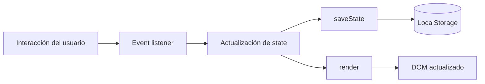

# Arquitectura técnica — Clases App

## Visión general

Clases App es una PWA sin backend externo. Toda la lógica se ejecuta en el navegador y los datos se guardan en LocalStorage.

La aplicación adopta un enfoque simple de estado centralizado:

```text
UI → eventos → estado → persistencia → render
```

## Componentes principales

### `index.html`

Define:
- cabecera;
- resumen diario;
- navegación por secciones;
- formularios modales;
- calendario;
- gestión;
- contenedores que luego completa JavaScript.

### `app.js`

Es el núcleo funcional del proyecto.

Responsabilidades:
- cargar y guardar estado;
- gestionar alumnos;
- gestionar horarios;
- registrar clases;
- registrar pagos;
- gestionar combos;
- calcular saldos;
- renderizar vistas;
- filtrar información;
- administrar calendario;
- exportar datos;
- vincular eventos dinámicos.

## Estado

La aplicación utiliza una estructura semejante a:

```js
{
  students: [],
  schedules: [],
  classes: [],
  payments: [],
  combos: []
}
```

El estado se serializa como JSON en LocalStorage.

## Flujo de actualización



## PWA

### Manifest

`manifest.webmanifest` define:
- nombre;
- nombre corto;
- colores;
- modo standalone;
- icono.

### Service Worker

`sw.js`:
- crea una caché versionada;
- almacena recursos esenciales;
- limpia cachés antiguas;
- responde primero desde caché cuando existe el recurso.

## Servidor local

`server.mjs` implementa un servidor HTTP con módulos nativos de Node.js.

No usa Express ni otras dependencias.

## Fortalezas técnicas

- cero dependencias de runtime;
- APIs nativas del navegador;
- PWA instalable;
- persistencia local;
- interfaz responsive;
- separación entre estructura, estilos y lógica;
- arquitectura fácil de desplegar.

## Limitaciones actuales

- LocalStorage no sincroniza entre dispositivos;
- no existe autenticación;
- los datos dependen del navegador;
- `app.js` concentra muchas responsabilidades.

## Evolución sugerida

Una refactorización futura podría dividir el código en módulos:

```text
src/
├── state/
├── students/
├── schedule/
├── attendance/
├── payments/
├── calendar/
└── ui/
```

Una segunda etapa podría agregar backend, autenticación y base de datos.
